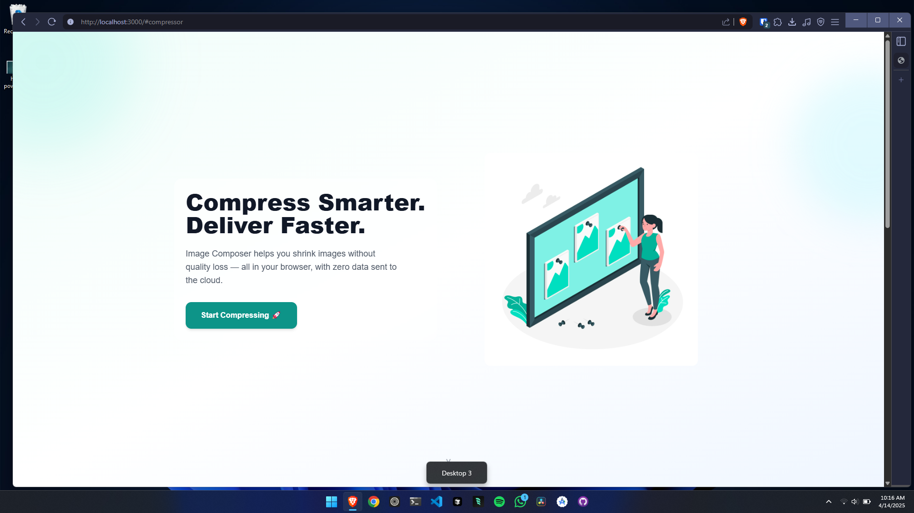
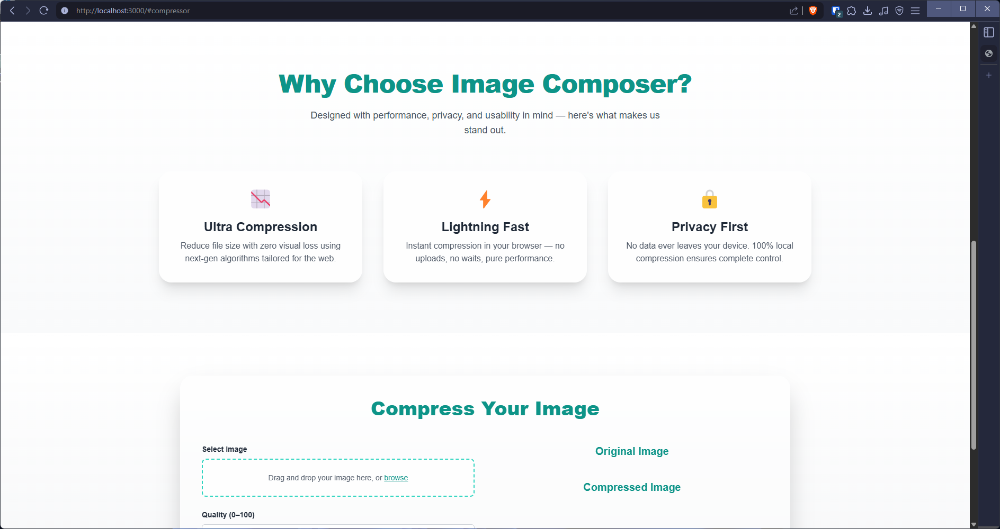
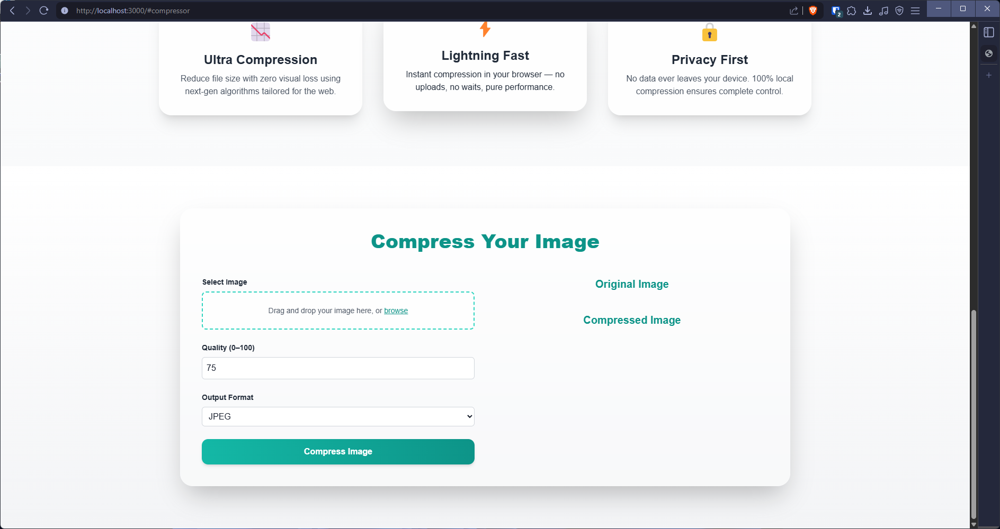

# 🎨 Image Composer

**Image Composer** is a lightweight and powerful Node.js application that lets you compose images while preserving high quality. Built with a simple and modern frontend using **Tailwind CSS** and **vanilla JavaScript**, this tool is perfect for quick image composition tasks.

🚀 [Live Demo](https://imagecomposer.onrender.com) | 📂 [GitHub Repository](https://github.com/rafay99-epic/ImageComposer)

## 🛠️ Features

- High-quality image composition
- Clean and intuitive user interface
- Fast performance with minimal setup
- Tailwind CSS powered frontend

## 📦 Installation & Setup

Follow these simple steps to get started locally:

```bash
# 1. Clone the repository
git clone https://github.com/rafay99-epic/ImageComposer.git

# 2. Navigate into the project directory
cd ImageComposer

# 3. Install dependencies
npm install

# 4. Start the application
npm start
```

The application will be available at: [http://localhost:3000](http://localhost:3000)

## 🌐 Live Demo

Want to try it right away?  
👉 [Click here to use Image Composer live](https://imagecomposer.onrender.com)

## 🤝 Contributing

Contributions are welcome and appreciated!  
If you have a feature request or would like to report a bug, please open an [issue](https://github.com/rafay99-epic/ImageComposer/issues).

To contribute:

1. Fork the repository
2. Create your feature branch (`git checkout -b feature/your-feature`)
3. Commit your changes (`git commit -m 'Add some feature'`)
4. Push to the branch (`git push origin feature/your-feature`)
5. Open a Pull Request

✅ Please make sure to update tests if you modify core functionality.

## 📄 License

This project is licensed under the [MIT License](./LICENSE).

## 📫 Contact

Made with ❤️ by [Abdul Rafay](https://rafay99.com)
For any questions or suggestions, feel free to reach out or create an issue on the repo.

## 📸 Site Screenshots

Take a look at some screenshots from **Image Composer** to get a feel for its interface and functionality:

### 🌐 **Landing Page**

The landing page gives users a quick overview of the app’s features, offering a smooth introduction and guide to get started with ease.


### 🛠️ **Features Showcase**

Explore the core features of Image Composer that enable efficient and high-quality image composition.  


### 📱 **Responsive Design**

Image Composer is designed to be fully responsive, ensuring a seamless user experience across all devices, from desktop to mobile.  

