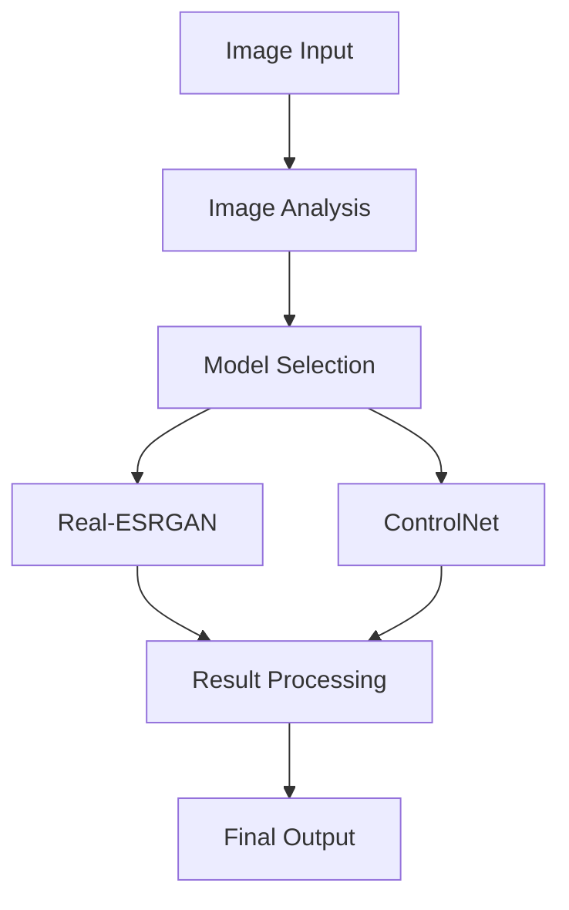

# AI Image Enhancement

## Overview

The AI Enhancement feature uses advanced machine learning models to automatically improve image quality. It intelligently selects between different AI models based on image characteristics and enhancement needs.

## Technical Architecture

### Components

- `ImageEnhancer.tsx`: Main enhancement component
- `ImageEnhancerUI.tsx`: Presentation layer
- `aiEnhancement.ts`: AI model integration and logic

### Flow Diagram



## Implementation Details

### Enhancement Options

```typescript
interface AIEnhancementOptions {
  model: "real-esrgan" | "controlnet";
  upscaleFactor: number; // 1-4
  denoise: number; // 0-100
  preserveDetails: boolean;
  quality: number; // 1-100
  format: "jpeg" | "png" | "webp";
}

const defaultOptions: AIEnhancementOptions = {
  model: "real-esrgan",
  upscaleFactor: 2,
  denoise: 50,
  preserveDetails: true,
  quality: 90,
  format: "jpeg",
};
```

### Core Functions

```typescript
// Main enhancement function
async function enhanceImageWithAI(
  base64Image: string,
  options: AIEnhancementOptions
): Promise<string>;

// Model selection logic
function selectOptimalModel(
  imageSize: { width: number; height: number },
  options: AIEnhancementOptions
): "real-esrgan" | "controlnet";

// Image preprocessing
async function preprocessImage(
  base64: string,
  options: AIEnhancementOptions
): Promise<string>;
```

## API Integration

### Replicate API

```typescript
interface ReplicateRequest {
  version: string;
  input: {
    image: string;
    scale: number;
    face_enhance: boolean;
    // Additional model-specific parameters
  };
}

async function callReplicateAPI(request: ReplicateRequest): Promise<string> {
  const response = await fetch("/api/replicate", {
    method: "POST",
    headers: {
      "Content-Type": "application/json",
    },
    body: JSON.stringify(request),
  });

  return await response.json();
}
```

## Model Selection

### Decision Logic

```typescript
function selectModel(image: HTMLImageElement, options: AIEnhancementOptions) {
  const { width, height } = image;
  const pixelCount = width * height;

  if (pixelCount > 1024 * 1024) {
    // Large images (>1MP) use ControlNet
    return "controlnet";
  } else if (options.upscaleFactor > 2) {
    // High upscaling uses Real-ESRGAN
    return "real-esrgan";
  } else {
    // Default to Real-ESRGAN for general use
    return "real-esrgan";
  }
}
```

## Image Processing Pipeline

### Preprocessing

```typescript
async function preprocessForAI(file: File): Promise<string> {
  // Convert to base64
  const base64 = await new Promise<string>((resolve, reject) => {
    const reader = new FileReader();
    reader.onload = () => resolve(reader.result as string);
    reader.onerror = reject;
    reader.readAsDataURL(file);
  });

  // Validate and optimize
  const img = await createImageBitmap(file);
  const canvas = document.createElement("canvas");
  canvas.width = img.width;
  canvas.height = img.height;

  const ctx = canvas.getContext("2d");
  ctx.drawImage(img, 0, 0);

  return canvas.toDataURL("image/jpeg", 0.95);
}
```

### Postprocessing

```typescript
async function postprocessResult(
  enhancedUrl: string,
  options: AIEnhancementOptions
): Promise<string> {
  const response = await fetch(enhancedUrl);
  const blob = await response.blob();

  // Convert format if needed
  if (options.format !== "jpeg") {
    return await convertFormat(blob, options.format);
  }

  return URL.createObjectURL(blob);
}
```

## Error Handling

### Common Errors

```typescript
class AIEnhancementError extends Error {
  constructor(message: string, public details: any) {
    super(message);
    this.name = "AIEnhancementError";
  }
}

try {
  const result = await enhanceImageWithAI(base64, options);
} catch (error) {
  if (error instanceof AIEnhancementError) {
    // Handle AI-specific errors
  } else if (error instanceof NetworkError) {
    // Handle API communication errors
  }
}
```

## Performance Optimization

### Memory Management

```typescript
function cleanup() {
  // Revoke object URLs
  URL.revokeObjectURL(enhancedImageUrl);

  // Clear temporary data
  setSelectedFile(null);
  setEnhancedImageUrl(null);
}
```

### Progress Tracking

```typescript
interface ProgressCallback {
  onStart: () => void;
  onProgress: (progress: number) => void;
  onComplete: (result: string) => void;
  onError: (error: Error) => void;
}

async function enhanceWithProgress(
  file: File,
  options: AIEnhancementOptions,
  callbacks: ProgressCallback
): Promise<void>;
```

## Integration Examples

### Basic Usage

```typescript
import { ImageEnhancer } from "@/components/ImageEnhancer";

function App() {
  return (
    <ImageEnhancer
      options={{
        model: "real-esrgan",
        upscaleFactor: 2,
        quality: 90,
      }}
      onComplete={(result) => {
        // Handle enhanced image
      }}
    />
  );
}
```

### Advanced Integration

```typescript
import { createAIPipeline } from "@/lib/ai";

const pipeline = createAIPipeline([
  validateInput,
  preprocessImage,
  enhanceWithAI,
  postprocessResult,
]);

const result = await pipeline.process(file, options);
```

## Best Practices

1. **Resource Management**

   - Implement proper cleanup
   - Handle memory efficiently
   - Cache results when appropriate

2. **Error Handling**

   - Validate input images
   - Handle API failures gracefully
   - Provide meaningful error messages

3. **User Experience**
   - Show progress indicators
   - Provide cancel functionality
   - Implement preview generation

## Troubleshooting

Common issues and solutions:

1. **Memory Issues**: Implement streaming
2. **API Failures**: Implement retries
3. **Quality Issues**: Adjust model parameters
4. **Performance**: Use optimal model selection

## Related Features

- Manual Enhancement
- Image Compression
- Format Conversion
- Batch Processing
