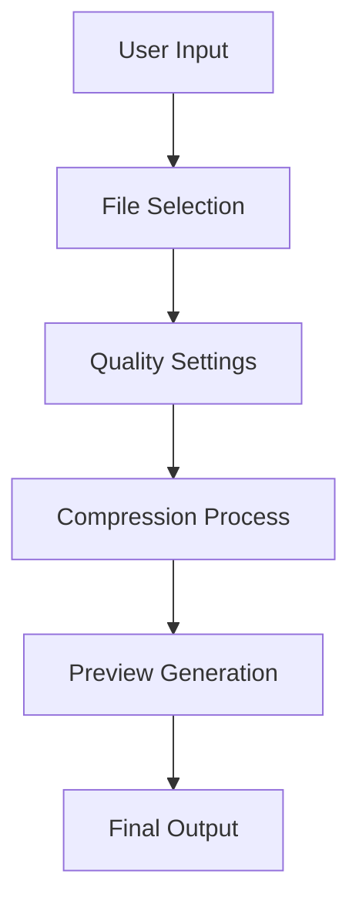

# Image Compression

## Overview

The image compression feature provides high-quality image compression while maintaining visual fidelity. It uses a combination of browser-native compression APIs and custom algorithms to achieve optimal results.

## Technical Architecture

### Components

- `ImageComposer.tsx`: Main component orchestrating the compression flow
- `ImageComposerUI.tsx`: Presentation layer handling user interactions
- `useImageComposer.ts`: Custom hook managing compression state and logic

### Flow Diagram



## Implementation Details

### Compression Algorithm

```typescript
// Quality ranges from 0 to 100
const compressImage = async (file: File, quality: number) => {
  const canvas = document.createElement("canvas");
  const ctx = canvas.getContext("2d");
  const img = await createImageBitmap(file);

  // Set dimensions
  canvas.width = img.width;
  canvas.height = img.height;

  // Draw and compress
  ctx.drawImage(img, 0, 0);
  return canvas.toBlob("image/jpeg", quality / 100);
};
```

### State Management

The compression state is managed through a custom hook that handles:

- File selection and validation
- Compression settings
- Progress tracking
- Error handling

## Configuration Options

### Quality Settings

```typescript
interface CompressionSettings {
  quality: number; // 0-100
  maxWidth?: number; // Optional width constraint
  maxHeight?: number; // Optional height constraint
  preserveExif: boolean; // Whether to keep metadata
}
```

### Format Support

- JPEG: Primary format with quality control
- PNG: Lossless compression
- WebP: Modern format with superior compression

## API Reference

### useImageComposer Hook

```typescript
const {
  compress,
  isCompressing,
  progress,
  error
} = useImageComposer(settings: CompressionSettings);
```

### Compression Methods

```typescript
// Single file compression
const compressSingle = async (file: File): Promise<Blob>;

// Batch compression
const compressBatch = async (files: File[]): Promise<Blob[]>;
```

## Events and Callbacks

```typescript
interface CompressionEvents {
  onProgress: (progress: number) => void;
  onComplete: (result: Blob) => void;
  onError: (error: Error) => void;
}
```

## Customization

### Custom Compression Profiles

You can define custom compression profiles for different use cases:

```typescript
const compressionProfiles = {
  web: { quality: 80, maxWidth: 1920 },
  thumbnail: { quality: 60, maxWidth: 300 },
  archive: { quality: 100 },
};
```

### UI Customization

The UI components accept custom styling through:

- Tailwind classes
- Custom CSS modules
- Inline styles

## Error Handling

```typescript
try {
  await compress(file);
} catch (error) {
  if (error instanceof UnsupportedFormatError) {
    // Handle unsupported format
  } else if (error instanceof CompressionError) {
    // Handle compression failure
  }
}
```

## Best Practices

1. **Memory Management**

   - Clean up object URLs after use
   - Use streaming for large files
   - Implement batch size limits

2. **Performance Optimization**

   - Use Web Workers for heavy compression
   - Implement progressive loading
   - Cache compressed results

3. **Quality Control**
   - Implement minimum quality thresholds
   - Add size/dimension validations
   - Preserve important metadata

## Integration Examples

### Basic Usage

```typescript
import { useImageComposer } from "@/hooks/useImageComposer";

const MyComponent = () => {
  const { compress } = useImageComposer({
    quality: 80,
    preserveExif: true,
  });

  const handleCompress = async (file: File) => {
    const compressed = await compress(file);
    // Handle compressed file
  };
};
```

### Advanced Integration

```typescript
import { createCompressionPipeline } from "@/lib/compression";

const pipeline = createCompressionPipeline([
  validateInput,
  preprocessImage,
  compressImage,
  optimizeOutput,
]);

const result = await pipeline.process(file);
```

## Troubleshooting

Common issues and solutions:

1. **Memory Issues**: Implement chunking for large files
2. **Quality Loss**: Adjust compression parameters
3. **Performance**: Use Web Workers for heavy operations
4. **Browser Compatibility**: Implement format fallbacks

## Related Features

- SVG Conversion
- Batch Processing
- Format Conversion
- Image Enhancement
