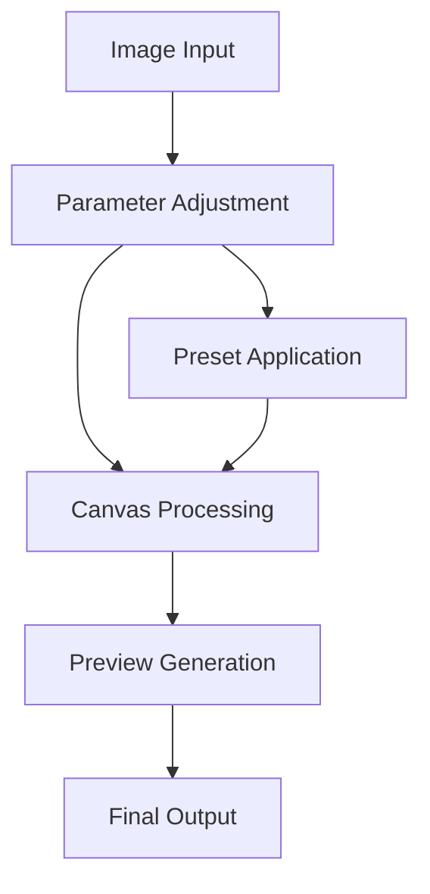

# Manual Image Enhancement

## Overview

The Manual Enhancement feature provides professional-grade tools for fine-tuning image quality. It offers granular control over various image parameters and supports batch processing with real-time previews.

## Technical Architecture

### Components

- `ManualEnhancer.tsx`: Main page component
- `manualEnhancement.ts`: Core enhancement logic
- `enhancementPresets.ts`: Predefined enhancement configurations

### Flow Diagram



## Implementation Details

### Enhancement Settings

```typescript
interface ManualEnhancementSettings {
  sharpness: number; // 0-200
  denoise: number; // 0-200
  brightness: number; // 0-200
  contrast: number; // 0-200
  saturation: number; // 0-200
  upscaleFactor: number; // 1-4
}

const defaultSettings: ManualEnhancementSettings = {
  sharpness: 50,
  denoise: 50,
  brightness: 100,
  contrast: 100,
  saturation: 100,
  upscaleFactor: 1,
};
```

### Core Enhancement Functions

```typescript
// Single image enhancement
async function enhanceImage(
  imageUrl: string,
  settings: ManualEnhancementSettings
): Promise<string>;

// Batch processing
async function enhanceMultipleImages(
  images: { url: string; selected: boolean }[],
  settings: ManualEnhancementSettings,
  onProgress?: (current: number, total: number) => void
): Promise<string[]>;
```

## Canvas Operations

### Image Processing Pipeline

```typescript
// Apply filters
ctx.filter = `
  brightness(${settings.brightness}%)
  contrast(${settings.contrast}%)
  saturate(${settings.saturation}%)
  blur(${settings.denoise / 10}px)
`;

// Draw image
ctx.drawImage(img, 0, 0, canvas.width, canvas.height);

// Apply sharpness
if (settings.sharpness > 0) {
  const imageData = ctx.getImageData(0, 0, canvas.width, canvas.height);
  const data = new Uint8ClampedArray(imageData.data);
  const sharpenFactor = settings.sharpness / 100;

  // Unsharp masking algorithm
  for (let i = 0; i < data.length - 4; i += 4) {
    const r = data[i];
    const g = data[i + 1];
    const b = data[i + 2];
    data[i] = Math.min(255, r + (r - 128) * sharpenFactor);
    data[i + 1] = Math.min(255, g + (g - 128) * sharpenFactor);
    data[i + 2] = Math.min(255, b + (b - 128) * sharpenFactor);
  }

  imageData.data.set(data);
  ctx.putImageData(imageData, 0, 0);
}
```

## Feature Flags

### Available Flags

```typescript
interface FeatureFlags {
  sharpnessAdjustment: boolean;
  noiseReduction: boolean;
  colorAdjustments: boolean;
  upscaling: boolean;
  enhancementPresets: boolean;
  batchProcessing: boolean;
  dragAndDrop: boolean;
}
```

### Usage

```typescript
if (isFeatureEnabled("sharpnessAdjustment")) {
  // Show sharpness controls
}

if (isFeatureEnabled("batchProcessing")) {
  // Enable multiple file selection
}
```

## Enhancement Presets

### Preset Structure

```typescript
interface EnhancementPreset {
  name: string;
  description: string;
  icon: string;
  settings: ManualEnhancementSettings;
}
```

### Available Presets

```typescript
const enhancementPresets = [
  {
    name: "Vivid",
    description: "Enhance colors and details",
    icon: "✨",
    settings: {
      brightness: 110,
      contrast: 120,
      saturation: 130,
      sharpness: 70,
      denoise: 30,
      upscaleFactor: 1,
    },
  },
  // Additional presets...
];
```

## Error Handling

### Common Errors

```typescript
try {
  await enhanceImage(imageUrl, settings);
} catch (error) {
  if (error instanceof CanvasError) {
    // Handle canvas operation failures
  } else if (error instanceof ImageLoadError) {
    // Handle image loading issues
  }
}
```

## Performance Optimization

### Memory Management

```typescript
function cleanup() {
  // Release object URLs
  previews.forEach(URL.revokeObjectURL);

  // Clear canvas
  canvas.width = canvas.height = 0;
  ctx.clearRect(0, 0, width, height);
}
```

### Batch Processing

```typescript
async function processBatch(
  files: File[],
  settings: ManualEnhancementSettings,
  batchSize = 3
): Promise<string[]> {
  const results = [];

  // Process in batches to manage memory
  for (let i = 0; i < files.length; i += batchSize) {
    const batch = files.slice(i, i + batchSize);
    const batchResults = await Promise.all(
      batch.map((file) => enhanceImage(file, settings))
    );
    results.push(...batchResults);
  }

  return results;
}
```

## Integration Examples

### Basic Usage

```typescript
import { ManualEnhancer } from "@/components/ManualEnhancer";

function App() {
  return (
    <ManualEnhancer
      settings={defaultSettings}
      onEnhance={(result) => {
        // Handle enhanced image
      }}
    />
  );
}
```

### Advanced Integration

```typescript
import { createEnhancementPipeline } from "@/lib/enhancement";

const pipeline = createEnhancementPipeline([
  validateInput,
  applyPreset,
  processImage,
  generateOutput,
]);

const result = await pipeline.process(file, settings);
```

## Best Practices

1. **Resource Management**

   - Clean up object URLs after use
   - Implement proper canvas cleanup
   - Use batch processing for multiple files

2. **Performance**

   - Implement progressive loading
   - Use Web Workers for heavy processing
   - Cache results when appropriate

3. **Quality Control**
   - Validate input images
   - Implement preview generation
   - Preserve metadata when needed

## Troubleshooting

Common issues and solutions:

1. **Memory Issues**: Use batch processing
2. **Performance**: Implement Web Workers
3. **Quality Loss**: Adjust processing parameters
4. **Browser Support**: Implement fallbacks

## Related Features

- AI Enhancement
- Image Compression
- Format Conversion
- Batch Processing
