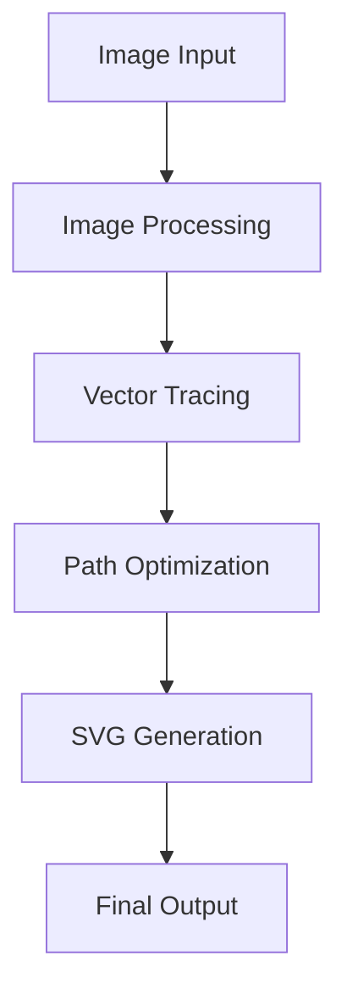

# SVG Converter

## Overview

The SVG Converter feature transforms raster images (PNG, JPG) into scalable vector graphics (SVG) format. It uses advanced algorithms for tracing and optimization while providing extensive customization options.

## Technical Architecture

### Components

- `SvgConverter.tsx`: Main conversion component
- `ImageProcessing.ts`: Core image processing utilities
- `SvgOptimizer.ts`: SVG optimization and cleanup

### Flow Diagram



## Implementation Details

### Conversion Process

1. **Image Preprocessing**

   ```typescript
   interface PreprocessingOptions {
     brightness: number; // 0-200
     contrast: number; // 0-200
     saturation: number; // 0-200
     blur: number; // 0-10
     grayscale: boolean;
   }
   ```

2. **Vector Tracing**

   ```typescript
   interface TracingOptions {
     threshold: number; // 0-255
     steps: number; // Color quantization steps
     background: string; // Background color
     transparent: boolean;
   }
   ```

3. **SVG Optimization**
   ```typescript
   interface OptimizationOptions {
     precision: number; // Decimal precision
     simplify: boolean; // Path simplification
     cleanupIDs: boolean; // Clean random IDs
     mergePaths: boolean; // Merge similar paths
   }
   ```

## Configuration Options

### SVG Settings

```typescript
interface SvgOptions {
  quality: number; // 1-100
  backgroundColor: string; // CSS color
  transparent: boolean; // Transparency support
  embedImage: boolean; // Base64 embedding
  optimizeSvg: boolean; // Enable optimization
  includeMetadata: boolean; // Include image metadata
}
```

### Image Adjustments

```typescript
interface ImageAdjustments {
  brightness: number; // 0-200
  contrast: number; // 0-200
  saturation: number; // 0-200
  blur: number; // 0-10
  grayscale: boolean;
}
```

## API Reference

### Core Functions

```typescript
// Convert image to SVG
async function convertToSvg(file: File, options: SvgOptions): Promise<string>;

// Optimize SVG output
function optimizeSvg(svg: string, options: OptimizationOptions): string;

// Apply image adjustments
function applyImageAdjustments(
  ctx: CanvasRenderingContext2D,
  adjustments: ImageAdjustments
): void;
```

## Canvas Operations

### Drawing and Filters

```typescript
// Apply canvas filters
ctx.filter = `
  brightness(${settings.brightness}%)
  contrast(${settings.contrast}%)
  saturate(${settings.saturation}%)
  blur(${settings.blur}px)
`;

// Draw with adjustments
ctx.drawImage(img, 0, 0, width, height);
```

### SVG Generation

```typescript
// Generate SVG string
let svgString = `<?xml version="1.0" encoding="UTF-8" standalone="no"?>
<svg xmlns="http://www.w3.org/2000/svg" 
     width="${width}" 
     height="${height}"
     viewBox="0 0 ${width} ${height}">
  ${metadata}
  ${paths}
</svg>`;
```

## Customization

### Custom Filters

```typescript
interface CustomFilter {
  name: string;
  process: (imageData: ImageData) => ImageData;
}

// Example custom filter
const sharpenFilter: CustomFilter = {
  name: "sharpen",
  process: (imageData) => {
    // Implement sharpening algorithm
    return processedData;
  },
};
```

### Metadata Templates

```typescript
interface MetadataTemplate {
  title: string;
  creator: string;
  software: string;
  date: string;
  description: string;
}
```

## Error Handling

### Common Errors

```typescript
class UnsupportedImageError extends Error {
  constructor(format: string) {
    super(`Unsupported image format: ${format}`);
  }
}

class SvgGenerationError extends Error {
  constructor(reason: string) {
    super(`Failed to generate SVG: ${reason}`);
  }
}
```

## Performance Optimization

### Memory Management

```typescript
// Clean up resources
function cleanup() {
  URL.revokeObjectURL(imageUrl);
  canvas.width = canvas.height = 0;
  ctx.clearRect(0, 0, width, height);
}
```

### Batch Processing

```typescript
async function processBatch(
  files: File[],
  options: SvgOptions
): Promise<string[]> {
  const results = [];
  for (const file of files) {
    const svg = await convertToSvg(file, options);
    results.push(svg);
  }
  return results;
}
```

## Integration Examples

### Basic Usage

```typescript
import { SvgConverter } from "@/components/SvgConverter";

function App() {
  return (
    <SvgConverter
      options={{
        quality: 90,
        transparent: true,
        optimizeSvg: true,
      }}
      onConvert={(svg) => {
        // Handle converted SVG
      }}
    />
  );
}
```

### Advanced Integration

```typescript
import { createSvgPipeline } from "@/lib/svg";

const pipeline = createSvgPipeline([
  preprocessImage,
  traceVectors,
  optimizePaths,
  generateSvg,
]);

const svg = await pipeline.process(file, options);
```

## Best Practices

1. **Input Validation**

   - Check file types and sizes
   - Validate image dimensions
   - Verify color spaces

2. **Resource Management**

   - Implement proper cleanup
   - Handle memory efficiently
   - Cache results when appropriate

3. **Output Quality**
   - Balance optimization levels
   - Preserve important details
   - Maintain aspect ratios

## Troubleshooting

Common issues and solutions:

1. **Memory Usage**: Implement streaming for large files
2. **Quality Loss**: Adjust tracing parameters
3. **Performance**: Use Web Workers
4. **Browser Support**: Implement fallbacks

## Related Features

- Image Compression
- Format Conversion
- Image Enhancement
- Batch Processing
